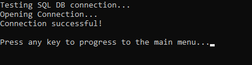
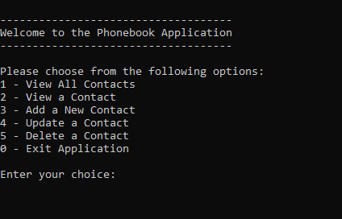
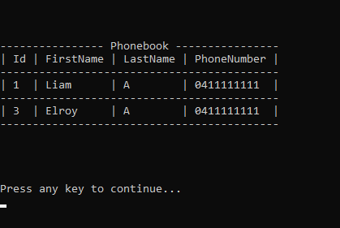

# Phonebook-EFCore-ConsoleApp

C# Console CRUD App implemented using Entity Framework Core and SQL Server.

**SQL Connection Test**

    

**CRUD Menu Screen**

    

**Database Sample View**

    

Nuget Packages used:
* Microsoft Entity Framework Core
* Microsoft Entity Framework Core SqlServer
* Microsoft Entity Framework Core Tools
* ConsoleTableExt (Used for Visualizing Data in a Table)
